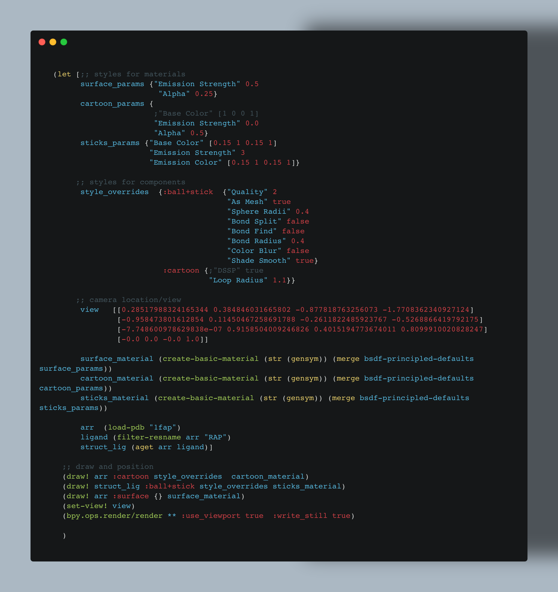
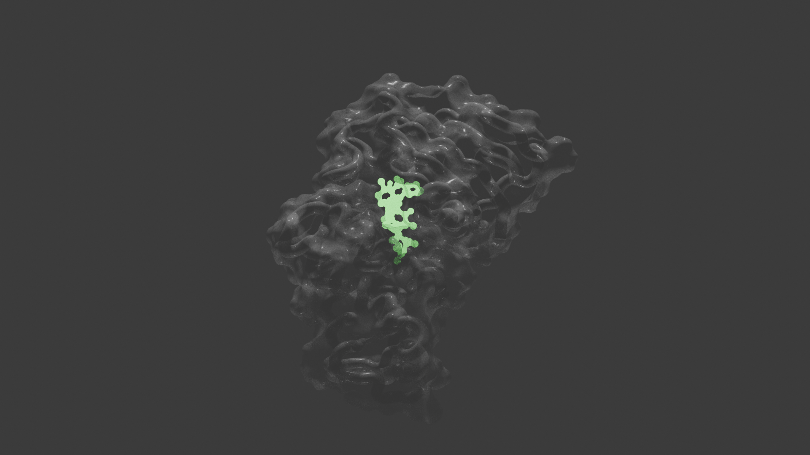

# basimol


## Usage


### Start Working in the Repl

```sh
# install Blender
# install pixi

pixi run repl

# setup repl based eval like VSCode-Calva
# pixi run docs
```


## Example 

- load 1FAP
- select polymer && select ligand
- define styles and materials
- draw:  polyer as cartoon, polymer as surface; ligand as emmissive balls and stick

<div style="display: flex; flex-direction: row; width: 100%;">
    
    
</div>
